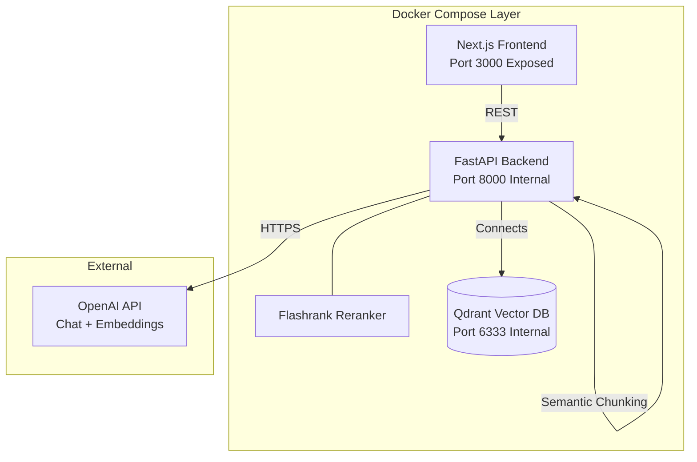

<div align="center">

<h1>📘 Chat with Your PDF</h1>
<h3>A Self-Hosted RAG System with Semantic Retrieval, Powered by OpenAI</h3>

<p>
  
  
  
       
  
  
  
</p>

<p>
  <b>Upload a PDF. Ask document-grounded questions. Get cited answers via semantic chunking, hybrid Qdrant + BM25 retrieval, and OpenAI generation.</b>
</p>

<br/>

</div>

---

## 🌟 Project Philosophy

This is a **self-hosted RAG orchestration layer** distributed as an open source tool.

- 🐳 **Fully containerized** — UI, API, and vector store all start with one `docker compose up`
- 🔑 **Bring your own OpenAI key** — generation and embeddings run on OpenAI's API; nothing else leaves your machine
- ⚡ **One-command startup after initial setup**
- 🏭 **Every component has a direct production equivalent**
- 🧠 **Self-hosted retrieval** — Qdrant, BM25, and reranking run entirely inside your own Docker network

---

## 🏗️ System Architecture



### Components Isolation
- **Next.js frontend (`localhost:3000`)**: The *only* visible interface — now also containerized.
- **FastAPI / Qdrant**: Securely locked inside the Docker network.
- **OpenAI**: The only external dependency — reached over HTTPS for chat completions and embeddings.

---

## 🛠️ Technology Stack Breakdown

| Layer | Technology | Details |
|---|---|---|
| **Frontend UI** | Next.js + React | Clean UI handling PDF uploads and chat; containerized. |
| **Backend API** | FastAPI + Uvicorn | Dedicated async API orchestration layer separating UI from mechanics. |
| **Orchestration** | LangChain | Framework tying retrieval + generation. |
| **Vector Database** | Qdrant | Concurrent-safe, dockerized, persistent volume. |
| **Embeddings** | OpenAI `text-embedding-3-small` | 1536-dimensional embeddings via the OpenAI API, batched with parallel requests. |
| **Chunking** | Semantic Chunking | Breaks by conceptual boundaries instead of naive physical characters. |
| **Sparse Retrieval** | BM25 | Pure keyword lookups for specific nouns and names. |
| **Reranker** | Flashrank | Fast ONNX CPU reranking to filter top 20 fused candidates to the top 5. |
| **Generation Model** | OpenAI `gpt-4o-mini` | Configurable via `OPENAI_CHAT_MODEL`. |

---

## 🚀 Advanced Retrieval Pipeline

```text
PDF Upload -> Text Extraction
       ↓
Semantic Chunking (respecting meaning, not max length)
       ↓
Chunk Quality Gate
       ↓
OpenAI Embeddings → Qdrant (Dense Index)   +   BM25 (Sparse Index)
       ↓
Reciprocal Rank Fusion (RRF) -> Top 20
       ↓
Flashrank Reranker -> Top 5
       ↓
Neighbor Context Expansion
       ↓
OpenAI Chat Completion -> Final Grounded Answer
```

---

## 📁 Project Structure

```text
APP/                     Application code (FastAPI service, RAG pipeline, evaluation)
docker/                  Dockerfiles for the api and ui services
data/                    All generated/runtime artifacts (gitignored)
  chunks/                Chunked documents (raw + quality-gated JSONL)
  indexes/               BM25 index
  evals/                 RAGAS datasets, generation cache, experiment results
  flashrank_cache/       Downloaded reranker model (persisted across restarts)
  qdrant_storage/        Qdrant's own persistent storage
tests/                   Unit tests
scripts/                 Smoke-test / one-off scripts
```

---

## 💻 Requirements

- [Docker Desktop](https://www.docker.com/) (or Docker Engine + Compose)
- An [OpenAI API key](https://platform.openai.com/api-keys)

No GPU and no local model downloads are required — generation and embeddings run on OpenAI's API.

---

## ⚙️ Setup & Deployment Flow

Get your RAG interface running in **under 5 minutes**:

### Step 1: Install Docker
Make sure [Docker Desktop](https://www.docker.com/) is installed and running.

### Step 2: Clone & Configure
```bash
git clone https://github.com/VaibhavGIT5048/Semantic-Question-Answering-over-Large-Documents-using-RAG-LLaMA-3-Ollama.git
cd Semantic-Question-Answering-over-Large-Documents-using-RAG-LLaMA-3-Ollama

# Copy environment config
cp .env.example .env
```
Edit `.env` and set `OPENAI_API_KEY=sk-...` (the other variables have sane defaults).

### Step 3: Launch via Docker Compose
```bash
docker compose up
```

Open your browser to `http://localhost:3000` to start chatting!

---

## 📊 Evaluation & Diagnostics

The evaluation stack leverages the **RAGAS** framework, with OpenAI (`gpt-4o-mini` by default) as both the generation "student" and the judge.

### Metrics Validated:
- **Retrieval Metrics**: Recall@K, MRR, NDCG, Hit Rate
- **Generation Metrics**: Faithfulness, Context Precision, Answer Relevance
- **Diagnostics**: Independent robust OOD Evaluation endpoints.

*Because retrieval metrics run entirely independent of generation, evaluation stays fast even as dataset size grows.*

---

## 🔄 Updating to Latest Future Releases

```bash
git pull
docker compose up --build
```
Two commands rebuild only changed layers — pip's download cache (via BuildKit) and Docker's layer cache keep rebuilds fast. Changing the embedding model dimension requires re-ingesting your documents, since existing Qdrant vectors won't match the new size.

---

## 📄 License & Privacy

This project is licensed under the **MIT License**.
*Retrieval, storage, and orchestration are fully self-hosted in your own Docker network. Document text and questions are sent to OpenAI's API for embeddings and generation — no other third-party telemetry.*

---

## 🙋‍♂️ Author

<div align="center">

**Vaibhav**  
B.Tech Computer Science (Data Science & ML) | MRIIRS, Delhi  
President @ Data Dynamos | Hackathon Builder | ML Researcher

[](https://github.com/VaibhavGIT5048)

</div>

---

<div align="center">
       <sub>Built with Next.js, FastAPI, Docker, Qdrant & OpenAI.</sub>
</div>
